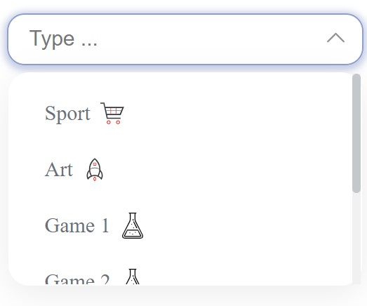
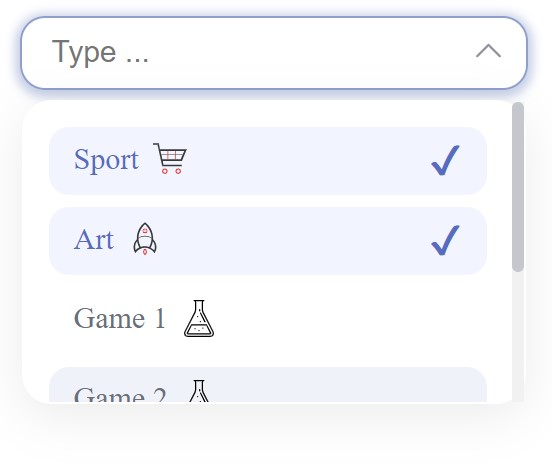

# Multi Select Dropdown

## Overview
This project is a example for creation of a multi-select dropdown component using React, TypeScript, and Vite.

  
  

To get started with the development demo environment:

<ol><li>Clone the repository.</li><li>Install dependencies using <code>npm install</code>.</li><li>Run the development server with <code>npm run dev</code>.</li><li>Explore the app and the mock data provided by MSW.</li></ol>

## Connect with Me

Feel free to connect with me on LinkedIn!

